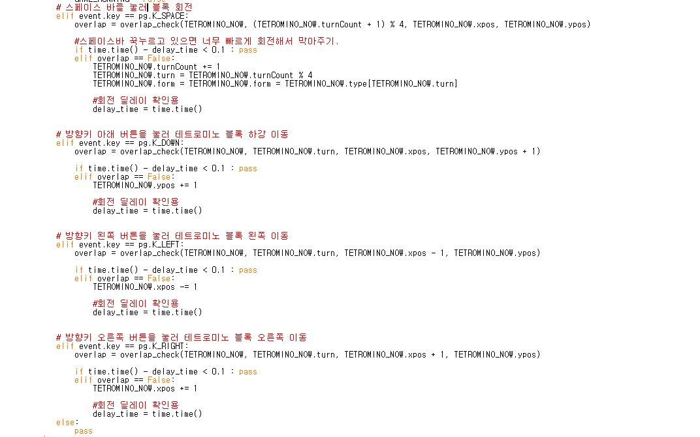
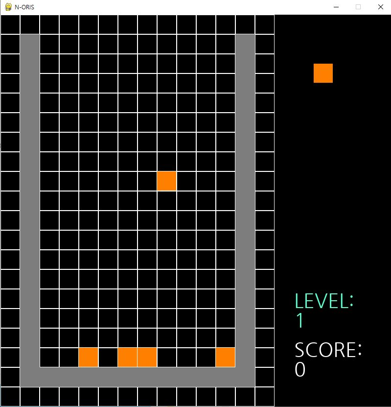
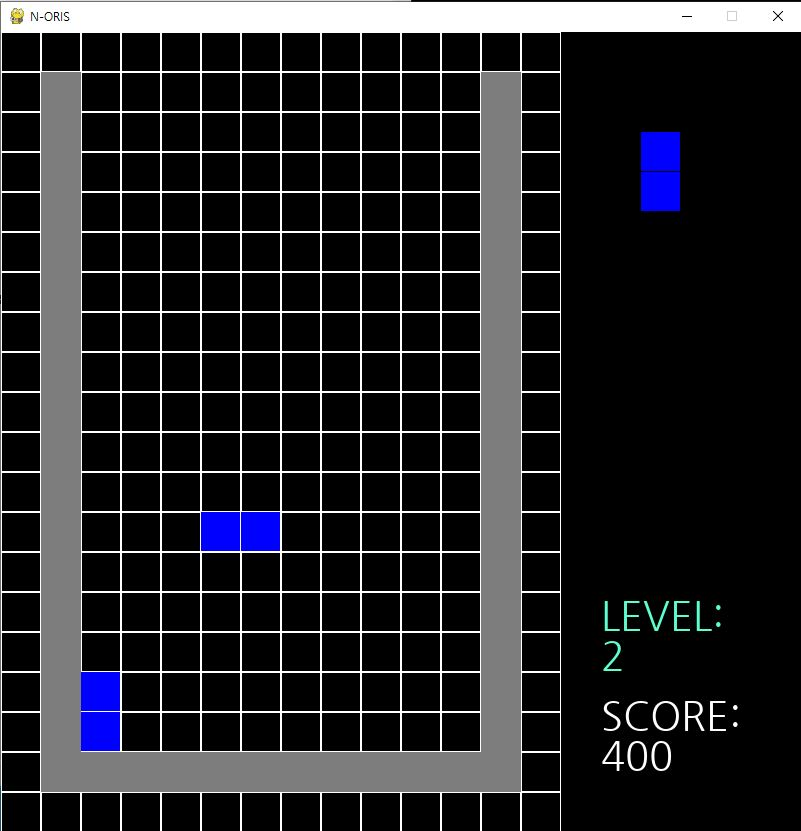
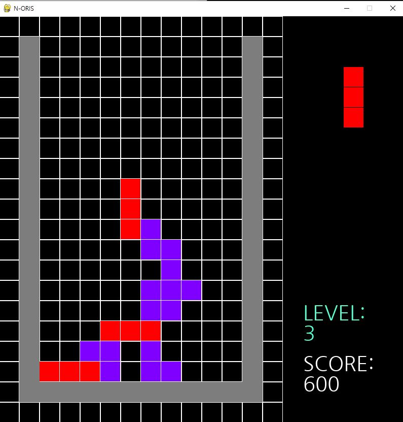
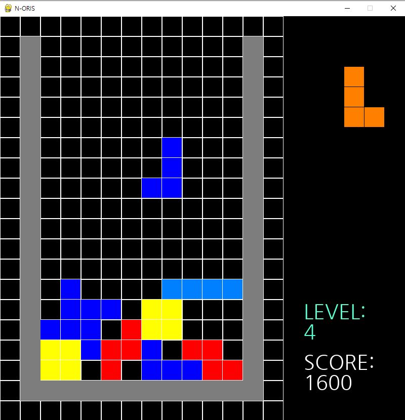
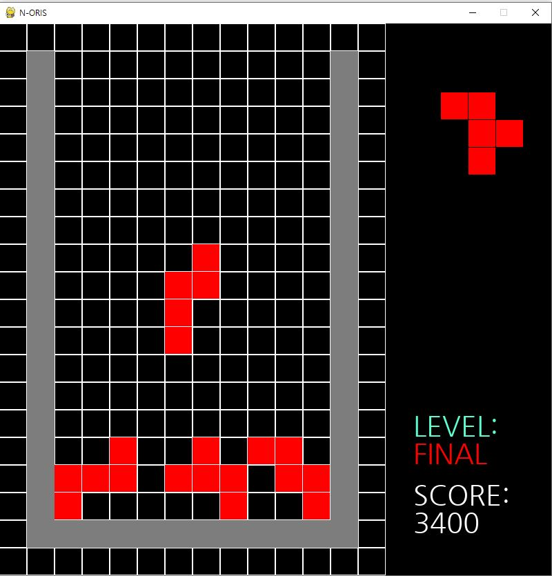

# tetris_game
파이썬 파이게임(pygame)을 이용한 게임제작 - 3. 테트리스 게임 개조
   

## 사용법
n-ris 파일 그대로 다운로드 후 적당한 실행 환경에서 코드 실행
 
&nbsp;개조할 때 파이썬 IDLE로 했음.
   

## 실행 화면
- 시작 화면  

 

- 게임 화면  

 

- 결과 화면  

## 개조시킨 내용들

- 조작감 수정  

## 단계에 따른 난이도 분화
 처음에는 쉬운 블록으로 라인맞추기를 실행
   
 이후, 라인을 채우고 점수를 얻음에 따라 레벨이 올라가고 레벨이 오를 때 마다 점차 어려워지는 블록들

- 1단계  

 
1개의 정사각형으로 만들어질 수 있는 블록들로만 구성된 레벨

- 2단계  

 
2개의 정사각형으로 만들어질 수 있는 블록들로만 구성된 레벨

- 3단계  

 
3개의 정사각형으로 만들어질 수 있는 블록들로만 구성된 레벨

- 4단계  

 
4개의 정사각형으로 만들어질 수 있는 블록들로만 구성된 레벨

- 마지막 단계  

 
5개의 정사각형으로 만들어질 수 있는 블록들로만 구성된 레벨

