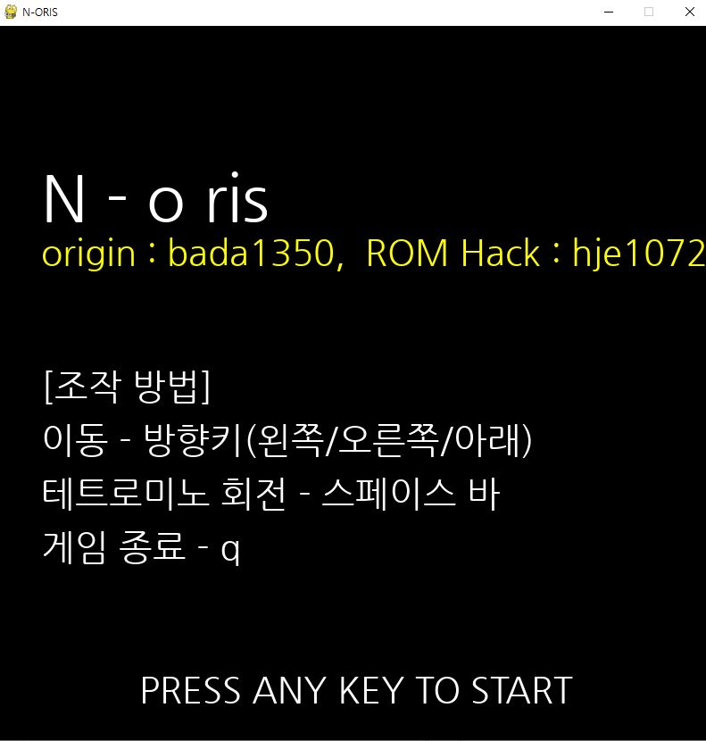
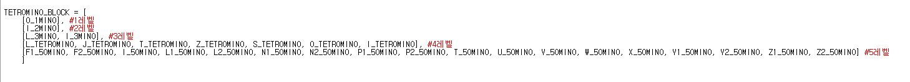

# tetris_game
파이썬 파이게임(pygame)을 이용한 게임제작 - 테트리스 게임.

우선, fork 할 수 있게 이 파일을 열어놓은 bada1350 님께 감사를 표합니다. 예전부터 만들어보고싶었던 테트리스가 어떻게 구현되는지 잘 알 수 있는 시간이었습니다.

  

우리가 잘 아는 테트리스게임입니다. 난이도에 따른 블록의 모양을 변형시키는 변주를 줘봤습니다.

 
테트리스의 어원은 테트로미노라는 4개의 정사각형으로 이루어진 블록들로 게임을 해서 테트로미노의 테트 를 따 테트리스라는 게임이 되었습니다.
하지만, 이 개조판에서는 난이도에 따라 처음에는 한 개의 블록으로 이루어져있는 블록만 나오고 이후, 2개의 블록으로 이루어져있는 블록 3개, 4개... 점점 늘어납니다.
테트로미노를 사용해서 만들어진 테트리스라는 이름을 이 게임에도 붙이기는 이상한 것 같아, n개의 정사각형으로 이루어진 블록으로 하는 게임이라는 표현으로
n - ORIS 라고 게임제목을 붙여봤습니다. 한번 잡솨보세요 ^^7

## 사용법
n-ris 파일 그대로 다운로드 후 적당한 실행 환경에서 py 파일 실행
 
&nbsp;개조할 때 파이썬 IDLE로 했음.
   
코드에 대한 자세한 내용은 주석참고

## 실행 화면
- 시작 화면  

 

- 게임 화면  

 

- 결과 화면  

## 개조시킨 내용들

- 조작감 수정  

 
 버튼 사이에 약간의 딜레이를 줌으로써 연속회전이나 너무 과격한 이동을 없앴음.  
그렇다고 빠른 움직임이 필요할 때 너무 느리지 않을 정도로만 적당히 딜레이를 넣어줌.

- 난이도 수정   

 
 기존의 테트리스 모델에서 블록의 모양에 변형을 줘봤음.  
 점수에 따라 점차 복잡한 모양의 블록들이 나오게 함으로써 도전욕구 있는 게임이 되도록 함.

## 단계에 따른 난이도 분화
 처음에는 쉬운 블록으로 라인맞추기를 실행
   
 이후, 라인을 채우고 점수를 얻음에 따라 레벨이 올라가고 레벨이 오를 때 마다 점차 어려워지는 블록들

- 1단계  

 
1개의 정사각형으로 만들어질 수 있는 블록들로만 구성된 레벨

- 2단계  

 
2개의 정사각형으로 만들어질 수 있는 블록들로만 구성된 레벨

- 3단계  

 
3개의 정사각형으로 만들어질 수 있는 블록들로만 구성된 레벨

- 4단계  

 
4개의 정사각형으로 만들어질 수 있는 블록들로만 구성된 레벨

- 마지막 단계  

 
5개의 정사각형으로 만들어질 수 있는 블록들로만 구성된 레벨

